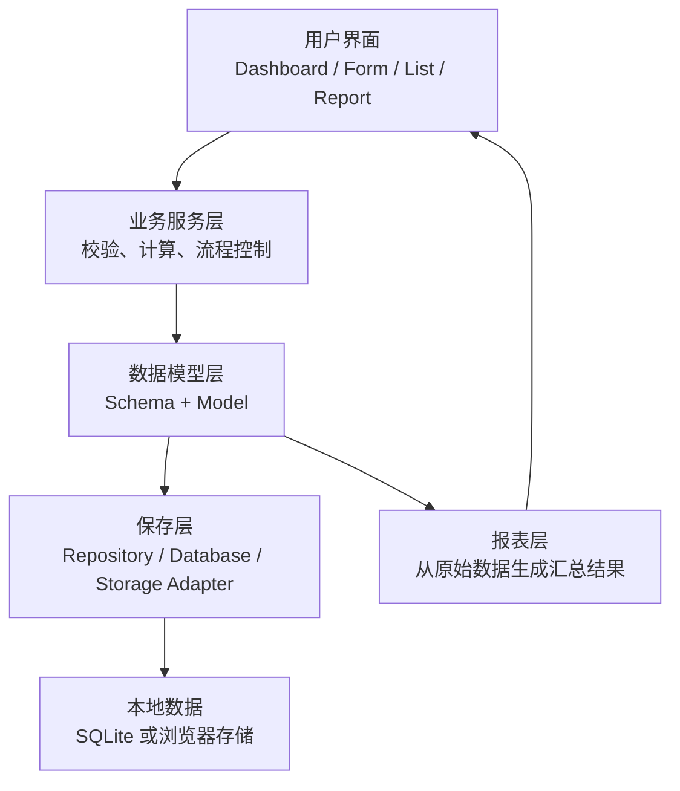
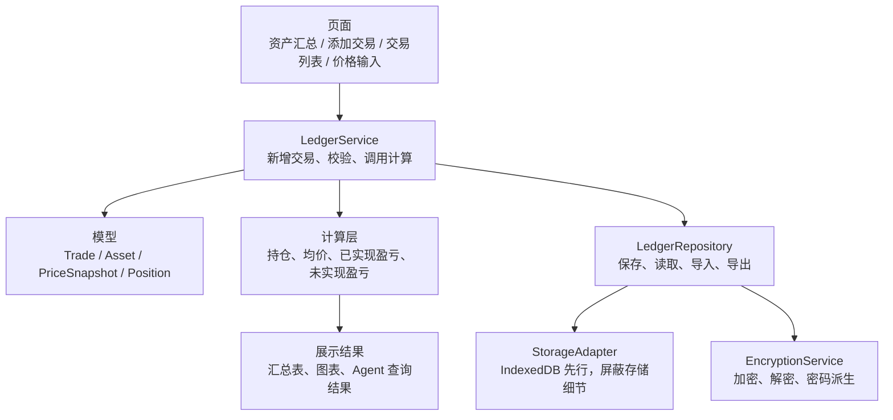

# Frappe Books 参考骨架图

用途：把 `frappe-books-typescript` 当作临摹对象，学习一个成熟本地财务软件如何组织数据、业务逻辑、保存层和报表。

原则：

- 只学结构，不照搬规模。
- 只服务 Local-First Trading Ledger。
- 每次最多看一个模块，看完写 3 条可借鉴点。

---

## 一句话结论

Frappe Books 对本项目有参考价值，但它是完整会计软件；你的项目是个人投资账本。要临摹的是“分层方式”和“财务正确性意识”，不是 POS、发票、税务、多语言这些功能。

---

## 总体骨架图



对应到你的 Ledger：



---

## 可以临摹的 5 个方向

### 1. Schema：先描述数据形状

Frappe Books 参考位置：

- `frappe-books-typescript/schemas/README.md`
- `frappe-books-typescript/schemas/app/SalesInvoice.json`
- `frappe-books-typescript/schemas/app/Payment.json`
- `frappe-books-typescript/schemas/app/AccountingLedgerEntry.json`

你要学什么：

- 每种数据都有清楚字段。
- 字段包含类型、是否必填、是否只读、关联对象。
- 数据结构先稳定，页面和计算才不会乱。

你的对应设计：

- `Trade`
- `Asset`
- `PriceSnapshot`
- `LedgerState`
- `schemaVersion`

第一版不要做：

- 不做动态表单生成器。
- 不做完整 schema builder。
- 不做复杂关联关系。

---

### 2. Model：把业务规则放在模型或服务里

Frappe Books 参考位置：

- `frappe-books-typescript/models/README.md`
- `frappe-books-typescript/models/baseModels/Invoice/Invoice.ts`
- `frappe-books-typescript/models/baseModels/Payment/Payment.ts`
- `frappe-books-typescript/models/Transactional/LedgerPosting.ts`

你要学什么：

- 页面不负责财务规则。
- 业务对象负责校验、计算和状态变化。
- 财务软件要主动阻止错误数据。

你的对应规则：

- 买入数量必须大于 0。
- 卖出数量不能超过当前持仓。
- 手续费不能为负。
- 价格必须大于 0。
- 同一批测试交易算出的结果必须稳定。

第一版不要做：

- 不照搬复式记账。
- 不做 debit / credit 双分录。
- 不做会计科目系统。

---

### 3. Repository：页面不要直接保存数据

Frappe Books 参考位置：

- `frappe-books-typescript/backend/database/core.ts`
- `frappe-books-typescript/backend/database/manager.ts`
- `frappe-books-typescript/fyo/core/dbHandler.ts`

你要学什么：

- 数据读写要有统一入口。
- 页面不应该知道底层是 SQLite、IndexedDB 还是未来文件存储。
- 后续迁移、加密、备份都应该集中在保存层处理。

你的对应设计：

```text
LedgerRepository
- loadLedger()
- saveLedger()
- clearLedger()
- exportBackup()
- importBackup()
```

再往下：

```text
StorageAdapter
- read()
- write()
- remove()
```

第一版不要做：

- 不写复杂 ORM。
- 不急着上 SQLite。
- 不让 React/Vue 组件直接调用浏览器存储。

---

### 4. Report：从原始交易生成结果

Frappe Books 参考位置：

- `frappe-books-typescript/reports/Report.ts`
- `frappe-books-typescript/reports/GeneralLedger/GeneralLedger.ts`
- `frappe-books-typescript/reports/ProfitAndLoss/ProfitAndLoss.ts`
- `frappe-books-typescript/src/components/Report/ListReport.vue`

你要学什么：

- 报表不是新数据源，而是从原始数据计算出来。
- 报表要有 filters、columns、rows。
- 展示层只展示结果，不偷偷改计算逻辑。

你的对应报表：

- 资产汇总表
- 持仓明细表
- 已实现盈亏表
- 未来 Dashboard 图表

第一版报表字段：

```text
asset
quantity
averageCost
currentPrice
marketValue
realizedPnl
unrealizedPnl
```

---

### 5. UI 信息架构：页面类型要稳定

Frappe Books 参考位置：

- `frappe-books-typescript/src/pages/Dashboard/Dashboard.vue`
- `frappe-books-typescript/src/pages/ListView/ListView.vue`
- `frappe-books-typescript/src/pages/CommonForm/CommonForm.vue`
- `frappe-books-typescript/src/pages/Report.vue`

你要学什么：

- 一个成熟财务工具通常有 Dashboard、Form、List、Report。
- 页面类型稳定后，功能扩展不会到处乱塞。
- 开发时先做能用的页面，再慢慢变好看。

你的第一版页面：

- Dashboard：资产汇总
- TradeForm：添加交易
- TradeList：交易列表
- PriceSnapshotForm：手动价格输入

后续页面：

- Benchmark 页面
- NLP 输入页或输入组件
- Agent 问答页或侧边栏

---

## 不要临摹的部分

不要在暑假第一版做：

- POS
- 发票
- 税务
- 多语言
- 区域化
- 会计科目表
- 复式记账
- Electron 打包
- 自动更新
- 插件系统

原因：

- 这些是成熟产品复杂度，不是 MVP 必需品。
- 你的论文主线是 local-first、加密、本地账本、性能评估。
- 第一版越小，越容易完成、测试和写论文。

---

## Week 1 使用方式

最多花半天看 Frappe Books。

推荐顺序：

1. 看 `schemas/README.md`，理解它怎么描述数据。
2. 看 `models/README.md`，理解数据和业务规则怎么分开。
3. 看 `reports/Report.ts`，理解报表如何从数据生成。
4. 看 `backend/database/core.ts` 的注释，理解保存层为什么要抽象。
5. 记录 3 条可以放进自己项目的设计。

看完就回到自己的项目，不继续深挖。

---

## 给 Ledger 的第一版目录参考

```text
src/
  components/
    AssetSummary.tsx
    TradeForm.tsx
    TradeList.tsx
    PriceSnapshotForm.tsx
  models/
    trade.ts
    asset.ts
    priceSnapshot.ts
    position.ts
  services/
    ledgerService.ts
    calculationService.ts
    encryptionService.ts
  repositories/
    ledgerRepository.ts
    storageAdapter.ts
  utils/
    money.ts
    date.ts
    validation.ts
```

核心规则：

> 页面只负责输入和展示，计算归 service，保存归 repository，数据形状归 models。
