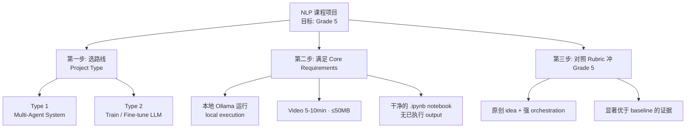

# 🗺️ NLP 课程总览 · Map of Content

> [!summary] 一句话定位
> 这门 **Introduction to NLP (`INBPA9947-17`)** 是 **3 学分**、**项目制 (project-based)** 课程。核心交付物只有三样:一个**能跑的 LLM application**、一段 **video**、一份干净的 **Jupyter notebook (`.ipynb`)**。我们的目标是 **`Grade 5 (Excellent)`**。

这是整个 `02_NLP` 文件夹的**中心枢纽 (hub)**。Obsidian 关系图谱 (graph view) 里,所有笔记都从这里发散出去。下面四份笔记,点进去就是细节。

---

## 📌 笔记导航 · Navigation

- [[01-通过标准与核心要求]] —— 想拿分,先满足的**硬性门槛 (hard requirements)**:出勤、video、notebook、Ollama、multi-agent。
- [[02-评分标准与拿5分策略]] —— 两套 **evaluation rubric**,逐档拆解 `Grade 1→5`,标出**拿 5 分到底要做到什么**。
- [[03-两种项目类型对比]] —— `Project Type 1` (multi-agent) vs `Project Type 2` (train/fine-tune) 的**中立对比**,帮你自己决定走哪条路。
- [[04-课程内容地图]] —— 从 `Tokenization` 到 `Agents` 的课程脉络图,每个 topic 一句话讲清「是什么 + 和项目啥关系」。

---

## 🎯 这张图就是你要做的事 · The Big Picture

---

## ⏱️ 30 秒搞清楚状况 · Quick Facts

| 项目 | 内容 |
| --- | --- |
| 课程 | Introduction to Natural Language Processing |
| 代码 | `INBPA9947-17` |
| 学分 | 3 |
| 形式 | 项目制 (做应用 + 录 video + 交 notebook) |
| 团队 | 1-4 人 (可单独做,也可 2-4 人组队) |
| 评分 | **非均分** —— 按个人贡献给分 (grades proportionate to contribution) |
| 本地要求 | 所有 agent 必须用 **Ollama** 本地跑 |
| 我的目标 | **Grade 5 (Excellent)** |

> [!tip] 提前准备的核心优势
> 你现在做的事 = 把「**选路线 → 满足硬要求 → 冲 5 分**」这条链在 9 月开课前想清楚。等真上课时,别人还在理解题目,你已经在打磨 `orchestration` 和 baseline 对比了。

---

## 🔑 核心关键词 · Key Terms (贯穿所有笔记)

理解这几个词,整门课的项目逻辑就通了:

- **Multi-Agent System (MAS)** —— 多智能体系统。把一个复杂问题**拆解 (decompose)** 给至少两个不同 agent 处理,而不是用一个「全能」prompt 硬扛。
- **Agentic Workflow** —— 智能体工作流。从 `Prompt Engineering`(调一个 prompt)升级到「多个有专门角色的 agent 协作」。这是本课程**最想让你证明的转变**。
- **Baseline** —— 基线。一个**单 prompt、单 agent** 的标准 chat 结果。你必须证明你的 multi-agent **明显打赢**它。
- **Orchestration** —— 编排。agent 之间怎么调度、怎么互相传递结果(高分关键看这里,比如 `iterative feedback loop` 迭代反馈循环)。
- **Ollama** —— 本地跑 LLM 的工具。本课硬性要求:**不许调云端 API**,全部 local execution。

---

#NLP #MOC
