# 🧭 04 · 课程内容地图 · Lecture Map

> [!summary] 一句话
> 这页把全部 lecture 串成一条**从「文本变数字」到「Agents」的脉络**。每个 topic 一句话讲清:**是什么 + 为什么重要 + 和项目啥关系**。先建立全局,等真上课时哪块要深挖,再单独开笔记。

⬅ 返回 [[00-NLP课程总览]] ｜ 选路线 [[03-两种项目类型对比]] ｜ 评分 [[02-评分标准与拿5分策略]]

> [!note] 关于 🅰️🅱️ 标记
> 🅰️ = 和 [[03-两种项目类型对比|Type 1 多智能体]] 关系大;🅱️ = 和 [[03-两种项目类型对比|Type 2 训练微调]] 关系大。两个都标 = 两条路都用得上。

---

## 🗺️ 课程脉络图 · The Learning Path

```mermaid
flowchart LR
    subgraph G1["I. 基础: 文本→数字"]
        A1["Tokenization"]
        A2["Text Representation<br/>(Embedding)"]
    end
    subgraph G2["II-III. 语言模型演进"]
        B1["fancy-RNN /<br/>CNN-TreeRNN"]
        B2["Transformer"]
    end
    subgraph G3["IV-VII. 训练与对齐"]
        C1["Pretrain"]
        C2["Prompting /<br/>RLHF"]
        C3["DPO / Training"]
        C4["Efficient<br/>Adaptation"]
    end
    subgraph G4["IX-XI. 评估·人·Agent"]
        D1["Evaluation<br/>(ARC Prize)"]
        D2["Human-Centered<br/>NLP"]
        D3["Agents"]
        D4["Hardware-aware<br/>Algorithms"]
    end
    G1 --> G2 --> G3 --> G4
```

---

## I. 基础:文本怎么变成数字 · Foundations

### Tokenization 🅰️🅱️
把一段文字切成模型能处理的**最小单位 (token)**。是所有 NLP 的**第一步**。
- **为什么重要**:`token` 数量直接决定你用掉多少 **`context window`**(上下文窗口)—— 这正是 [[02-评分标准与拿5分策略|Type 1 拿 5 分]]要「深入理解的参数」之一。
- **项目关系**:Type 2 的预处理 (preprocess) 也绕不开它。

### Text Representation I & II(`Embedding` 文本表示)🅰️🅱️
把 token 变成**向量 (vector)**,让语义相近的词在向量空间里也相近。核心词:**`embedding`**(嵌入)。
- **为什么重要**:`embedding` 是「机器理解语义」的地基,后面所有模型都建在它上面。
- **项目关系**:可用作 evaluation 的相似度度量;Type 2 数据可视化 (`EDA`) 常用它降维看分布。

---

## II-III. 语言模型的演进 · From RNN to Transformer

### fancy-RNN / CNN-TreeRNN 🅱️
早期处理序列的模型:**`RNN`** 系列(按顺序读)和 **`CNN`/`TreeRNN`**(用卷积/树结构)。
- **为什么重要**:理解它们的**局限**(难并行、长依赖记不住),才懂 `Transformer` 为什么是革命。属于「知道历史」的铺垫。

### Transformer ⭐ 🅰️🅱️
现代所有 LLM 的**底层架构**,核心是 **`attention`(注意力机制)**。
- **为什么重要**:你在 `Ollama` 上跑的每个模型,内核都是 Transformer。**整门课的技术心脏**。
- **项目关系**:两条路都建立在它之上,概念必须讲对(`Application` 档要求 `use technical keywords correctly`)。

---

## IV-VII. 训练与对齐 · Training & Alignment

### Pretrain(预训练)🅱️
在海量文本上无监督训练,得到一个**通用 base model**。
- **项目关系**:Type 2 的 `fine-tune` 就是在 pretrained 模型基础上接着调,不用从零开始。

### Question Answering(问答)🅰️🅱️
经典 NLP 任务:给定问题(和上下文)输出答案。
- **项目关系**:很适合当**应用场景** —— 无论做 multi-agent QA 还是训练一个 QA 模型,都是好的 real problem。

### Prompting & RLHF ⭐ 🅰️
**`Prompting`** = 怎么写指令让模型干活;**`RLHF`** = Reinforcement Learning from Human Feedback(用人类反馈做强化学习对齐)。
- **为什么重要**:`Prompting` 是 [[03-两种项目类型对比|Type 1]] 的看家本领 —— 每个 agent 的 `system prompt` 就是 prompt 工程。
- **项目关系**:Type 1 的 agent 角色设计直接吃这一讲。

### Life After DPO / Training 🅱️
**`DPO`** = Direct Preference Optimization(直接偏好优化),比 RLHF 更轻量的对齐方法;「Life After DPO」讲对齐技术的最新走向。
- **项目关系**:Type 2 想深入训练/对齐时的进阶武器。

### Efficient Adaptation ⭐ 🅱️
**高效微调**:用 `LoRA` 这类轻量方法,只调一小部分参数就让大模型适配新任务。
- **为什么重要**:题目要的是 **efficient** LLM —— 这一讲就是 Type 2「高效」二字的关键。
- **项目关系**:[[02-评分标准与拿5分策略|Type 2 拿 5 分]]要「至少 3 个模型」,高效微调让这件事算力上可行。

---

## IX-XI. 评估、以人为本、Agent · Evaluation, Humans, Agents

### Evaluation(+ ARC Prize 例子)⭐ 🅰️🅱️
怎么**科学地衡量**一个模型/系统好不好,包括 benchmark 设计;`ARC Prize` 是一个著名的推理能力挑战。
- **为什么重要**:**两条路的 5 分都卡在这** —— Type 1 要「证明 significantly 打赢 baseline」,Type 2 要「`complex benchmarking`」。这一讲教你怎么把对比做得有说服力。

### Human-Centered NLP 🅰️🅱️
以人为中心的 NLP:可用性、公平、安全、责任。
- **项目关系**:讲清你的应用「为谁解决什么真实问题」时用得上,也呼应 Type 2 的 `limitations` 讨论。

### Agents ⭐ 🅰️
**智能体**:能感知、决策、调用工具、和其他 agent 协作完成任务。
- **为什么重要**:**这就是 [[03-两种项目类型对比|Type 1]] 项目的理论核心**。`multi-agent`、`orchestration`、`agentic workflow` 全在这一讲。
- **项目关系**:走 Type 1 必精读。

### Hardware-aware Algorithms for Sequence Modeling 🅱️
**硬件感知**的序列建模算法(如优化 attention 的高效实现),让模型在真实硬件上跑得更快更省。
- **项目关系**:理解「为什么本地 `Ollama` 能跑得动」「efficient 模型怎么来的」,呼应算力约束。

---

## 🔗 把课程接回项目

- 看完这张图,回去对照 [[02-评分标准与拿5分策略]] 想:**我要拿 5 分,最该深挖哪几讲?**
- 走 Type 1 → 重点啃 **Prompting / RLHF + Agents + Evaluation**。
- 走 Type 2 → 重点啃 **Pretrain + Efficient Adaptation + Evaluation + Training**。
- 全局回到 [[00-NLP课程总览]]。

#NLP #课程内容
